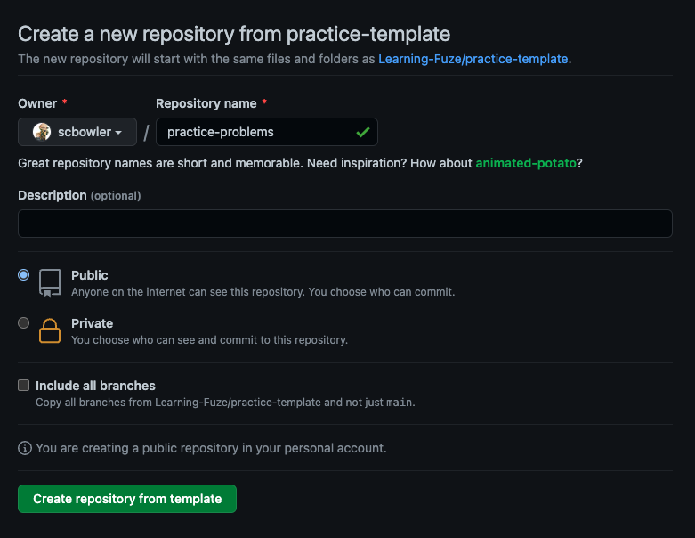

# Practice Template

An empty template that can be used for practice, practice problems, prototyping, fun, or anything else you want to do with it!

# Setup

1. "Use this template" to create a new repository
    
1. Complete new repo information
    1. Select **your** username as the **Owner**
    1. Give your repo a fitting name
    1. (optional) Give you repo a fitting description
    1. Choose to make your repo "Public" or "Private"
    1. **DO NOT** Include all branches
    1. Click "Create repository from template"
    
1. Once your repo has been created click the "Code" button and copy the **SSH** URL
    
1. Open **lfz-code**
1. Click blue button in bottom left corner of VS Code
    
1. Select: **Clone Repository in Container Volume...**
    
1. Paste your **SSH** URL into the input then press **ENTER/RETURN**
    
    1. **NOTE:** This step can take a little bit, be patient while the repo is cloned
    1. **NOTE:** Depending on what version you are using you may be asked to select a repo then a branch, if so select the name of the repo you are trying to clone (Usually at top of list), then select the **main** branch
1. You are good to go! Create a folder and start building!
    - Checkout the `__sample__` folder as an example basic project setup

# ISSUES

- If you run into issues using this template repo, make sure you are using the most recent version of **lfz-code** and that your **Docker** is updated to the latest version.
- If everything is up to date and you continue to run into issues reach out to an instructor for assistance.
